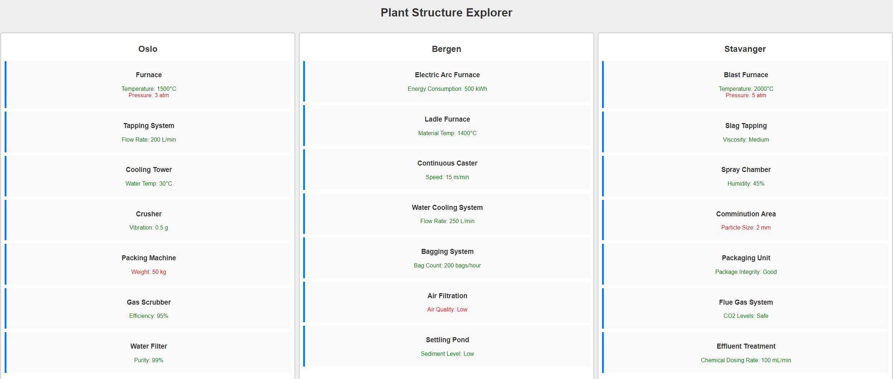

# Plant Structure Explorer

## Overview
The Plant Structure Explorer is a software application designed to improve operational efficiencies in metal processing plants. This tool enables users to interactively manage and navigate through complex plant hierarchies, enhancing the ability to locate and control processes, equipment, and sensors. Developed using the Unified Process (UP) framework and Unified Modeling Language (UML), this application offers a dynamic, real-time interactive interface for efficient plant operation management.

## Video Demo
A video demonstration of the Plant Structure Explorer is available within this repository. It provides an overview of the application's functionality and key features. [Watch the video here](./Plant%20Structure%20Explorer.mp4).

[](https://www.youtube.com/watch?v=GOhGNYrQp6o)

## Features
- **Interactive Plant Structure Visualization:** Navigate through a hierarchical view of plant processes, equipment, and sensors.
- **Real-Time Data Processing:** Updates and displays data in real-time without the need for page reloads using RESTful APIs and WebSocket connections.
- **Color-Coded Sensor Data:** Visual alerts (green, yellow, red) provide immediate insight into the operational status of equipment.
- **Expand/Collapse Functionality:** Users can expand or collapse nodes within the hierarchy for detailed or generalized views.
- **Search and Filter Options:** Quickly locate specific components within the plant structure.

## Installation

### Prerequisites
- Node.js
- Python 3
- MySQL

### Setting Up
1. **Clone the Repository:**
    ```
    git clone https://github.com/yourusername/plant-structure-explorer.git
    ```

2. **Navigate to the project directory:**
    ```
    cd plant-structure-explorer
    ```

3. **Install Dependencies:**
- Frontend:
  ```
  cd frontend
  npm install
  ```
- Backend:
  ```
  cd backend
  pip install -r requirements.txt
  ```

4. **Set up the Database:**
- Import the provided SQL file to your MySQL database to set up the initial database schema and data.

5. **Start the Application:**
- Frontend:
  ```
  npm start
  ```
- Backend:
  ```
  python app.py
  ```

## Usage
Navigate to `http://localhost:3000` to view the application. Use the interface to explore different plant structures, view sensor data, and manage plant components interactively.